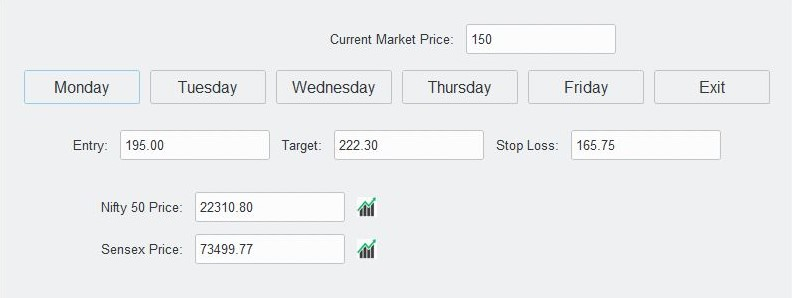

# Nifty Calculator

Nifty Calculator is a simple Python application built with Tkinter for calculating entry, target, and stop-loss prices based on current market prices and predefined multipliers for different trading days. It also displays real-time Nifty 50 and Sensex prices and indicates whether they have gone up or down since the last update.

## Features
### Educational Purpose
- Calculate entry, target, and stop-loss prices based on current market price and predefined multipliers for different trading days.
- **Real-time display** of Nifty 50 and Sensex prices.
- **Visual indication** of price changes for Nifty 50 and Sensex.

## Prerequisites

- Python 3.x
- Tkinter library
- ttkthemes library
- Pillow (PIL) library
- yfinance
- pyinstaller

## Preview


## Exe file
- Executable file can be made by using following command:
```bash
 pyinstaller --onefile --add-data "resources;resources" backend/backend.py frontend/frontend.py
